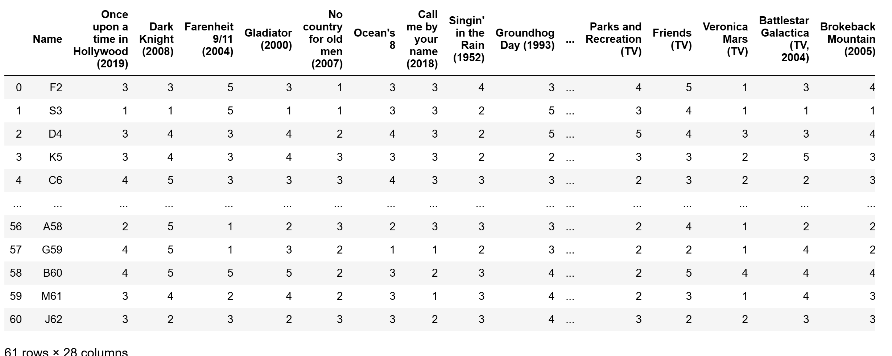
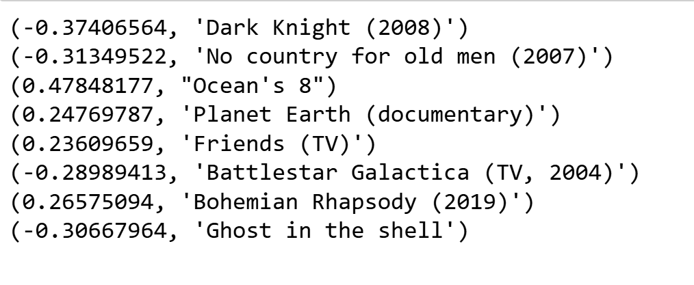

# Singular Value Decomposition

The singular value decomposition is a neat way to understand what is happening with matrix operations, and one good direction to interpret LLMs under the hood. We begin with a motivating example: the movie ratings data. The below is a snippet of preferences (from 1-5 where 5 is best) of 26 movies rated by 61 students (anonymized):

Let \\( R\\) be the \\(n\times p\\) matrix of these movie ratings, and let \\(X\\) be the centered version of \\(R\\) (namely, the mean of all the rows of \\(R\\) is subtracted out from each row of \\(R\\)). In this specific example, \\(n=61\\) and \\(p=26\\). From what we learned about PCA, the directions of maximum variance of the rows are captured by the eigenvectors of \\(X^TX\\). Let \\(V\\) be the matrix of eigenvectors of \\(X^TX\\), i.e. \\(V\\) is \\(p\times p\\) whose columns are the eigenvectors of \\(X^TX\\). Following convention, let the eigenvectors be arranged as the columns of \\(V\\), \\(\v_1\upto \v_n\\), with associated eigenvalues \\(\lambda_1\upto \lambda_p\\) satisfying \\(\lambda_1\ge \lambda_2\ge\cdots\ge \lambda_p\)). Therefore, we have for \\(i=1\upto p\\) that

$$ X^TX \v_i = \lambda_i \v_i. \tag*{(1)}$$

Say we do that and examine the eigenvectors. The eigenvectors assign
weights to the \\(p\\) movies, and are directions in the movie
space. In large datasets, we would probably think of them as "genres". With the
small set we have, we don't quite that level of detail, but we still get something. For example, the second eigenvector assigns the following weights:

A cursory post-fact interpretation may be that this direction weights heavy/intense movies at one end of the scale and lighter/relaxing ones at the other end. Not to worry, in larger systems, for example, weights in large language models, we will find much better interpretations and examples. The point is, the decomposition helped us find very interesting patterns in the data.

We could do the same with columns. For arguments sake, without worrying about
centering), let us say we start with \\(X^T\\), whose rows are the columns of \\(X\\). We would then take the eigendecomposition of the \\(n\times n\\) matrix \\( (X^T)^T X^T\\), ie \\(XX^T\\), and say the eigenvectors are in \\(U\\). Also note that multiplying both sides of Equation (1) with \\(X\\) on the left yields

$$ X X^T X \v_i = \lambda_i X\v_i, $$

which implies \\( X\v_i\\) is an eigenvector of \\(XX^T\\) with
eigenvalue \\(\lambda_i\\) for each \\(1\le i \le p\\).  Let the above
eigenvectors \\(X\v_i = \u_i\\). The remaining \\(n-p\\) eigenvectors
span the null space of \\(XX^T\\), so the rest of the eigenvalues are
0.

You can also verify the same way that if you fixed the eigenvectors of \\(XX^T\\) to be \\(u_1\upto \u_n\\), you would have that as long as \\(X^T\u_i\ne 0\\), we will have \\(X^T\u_i\\) will be an eigenvector of \\(X^TX\\). 

Putting these together, we have

$$ X^T X = V \Lambda V^T \text{ and } XX^T = U \Lambda U^T.$$

Multiplying the left equation by \\(X\\) on the left and noting \\(XV = U\begin{bmatrix} \Lambda \\ {\bf 0}\end{bmatrix} \\), we have

$$ XX^T X = U \begin{bmatrix} \Lambda^2 \\ 0 \end{bmatrix} V^T. $$
and therefore

$$ X = U \begin{bmatrix} \Lambda \\ 0 \end{bmatrix} V^T. $$

